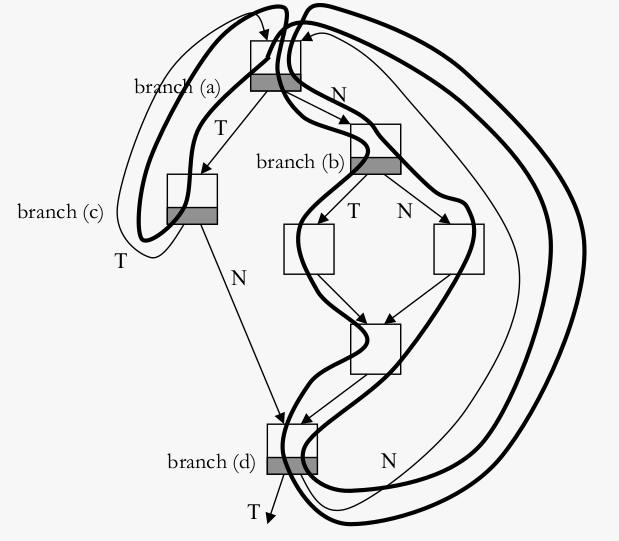

# GAg branch predictor
(a) Consider a GAg branch predictor. There are three history bits. What is the content of the
branch predictor table after a (sufficiently long) execution of the following sequence of branch
outcomes: TTTNNTTTNNTTTNN... where T stands for taken and N stands for not taken.
Assume 2-bit saturating counters in the PHT.

TTTNNTTTNNTTTNN...

|PHT  |binary |calculations |notes  |
|---  |---    |---          |---    |
|-    |000    |-            | |
|3    |001    |+1 +2 -> 3   | |
|-    |010    |-            | |
|3    |011    |+1 +1 -> 3   | |
|3    |100    |+1 +1 -> 3   | |
|-    |101    |-            | |
|0    |110    |-1 -1 -> 0   | TTN -> 110 -> next: N -> -1 |
|0    |111    |-1 -1 -> 0   | TTT is 111, since the next value is N -> -1 |

(b) Now consider a GAg branch predictor with two history bits, and the same branch outcome
sequence: TTTNNTTTNNTTTNN... What is the accuracy of this branch predictor during
steady-state (i.e., after the initialization phase) assuming all 2-bit saturating counters have an initial
value of 1?

TTTNNTTTNNTTTNN...

|PHT  |binary |calculations |notes  |
|---  |---    |---          |---    |
|1    |00     |-> 2         | |
|1    |01     |-> 2         | |
|1    |10     |-> 0         | |
|1    |11     |-> 2 -> 1 -> 2 -> 1 -> ... |repeats |

TT X\
TT X\
TN V\
NN V\
NT V

(c) Consider the following control flow graph:

 

The fat curve indicates how this control flow graph is traversed during the execution of the
program. Write down the branch behavior of the four conditional branches (denoted in gray in
the figure): use T for taken and N for not-taken.

Branch behavior for branch (a): TNNTNN... \
Branch behavior for branch (b): TNTNTN... \
Branch behavior for branch (c): TTT... \
Branch behavior for branch (d): NNN...

How many history bits does a PAg predictor need to perfectly predict the behavior of these four branches (after initialization)? (Assume there is no aliasing in the first level of the PAg branch predictor.)

| number of bits | branching |
| --- | --- |
| 1 | X |
| 2 | TN -> N |
|   | TN -> N |
| 3 | NTN -> N |
|   | NTN -> T |
| 4 | OK |
