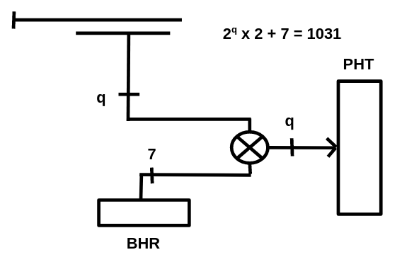
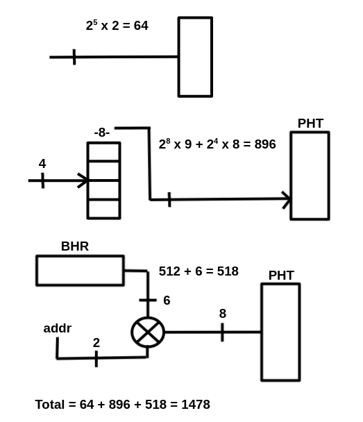

# Gshare versus hybrid predictor
Consider two branch predictors. 
Predictor A is a gshare predictor that combines 9 address bits and a 7-bit global history to index a PHT. 
Predictor B is a hybrid predictor consisting of a metapredictor, a global predictor, and a local predictor. 
The metapredictor is a bimodal predictor that indexes its PHT using 5 address bits. 
The local predictor is a PAg predictor and uses 4 address bits to index the local history table; 
the 8-bit local history is used to index a PHT consisting of 3-bit saturating counters. 
The global predictor is a GAp predictor and uses 6 global history bits and 2 address bits to index the PHT. 
Assume 2-bit saturating counters in all PHT tables. 
Draw a scheme for both predictors (with a clear illustration of how the indexing is done) 
and calculate the hardware cost (in number of bits) for both predictors. 
You can assume that the branch predictor is targeted at a RISC ISA with 4-byte instructions. 

Draw a scheme for predictor A: 

Draw a scheme for predictor B: 

Hardware cost (in number of bits) for predictor A: **1031**

Hardware cost (in number of bits) for predictor B: **1478**
