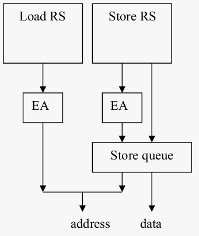

# Load forwarding and bypassing

Consider an out-of-order architecture that implements load forwarding and load bypassing. A
sequence of instructions is given, together with the time when the instruction enters the
reservation station (dispatch). Assume that an instruction that enters the reservation station can be
executed immediately, i.e., the operands are immediately available. Every store instruction also
has an entry indicating when the store instruction can leave the store queue at the earliest
(completion). Assume further that there is only one port to the cache, that all cache accesses are
cache hits, and that the execution of a load and store instruction takes 2 cycles: 1 cycle to
calculate the address (EA) and 1 cycle for the access to the cache. If a load and a store can access
memory in the same cycle, the load has priority over the store.

The architecture is as follows:

Consider the following sequence of instructions:

|dispatch|isntruction|completion|
|-|-|-|
|1|Load A| |
|1|Load B| |
|1|Store C|6|

Complete the following table:
|Cycle|Load RS|Store RS|Load EA|Store EA|Store queue|Cache access|
|-----|-------|--------|-------|--------|-----------|------------|
|1    |A,B    |C       |       |        |           |            |
|2    |B      |        |A      |C       |           |            |
|3    |       |        |B      |        |C          |A           |
|4    |       |        |       |        |C          |B           |
|5    |       |        |       |        |C          |            |
|6    |       |        |       |        |           |C           |

Now consider the following sequence:
|dispatch|isntruction|completion|
|-|-|-|
|1|Store A|6|
|2|Load B| |
|3|Load A| |
|4|Store D|10|
|4|Load E| |
|4|Load A| |
|5|Load D| |

Complete the following table:
|Cycle|Load RS|Store RS|Load EA|Store EA|Store queue|Cache access|
|-----|-------|--------|-------|--------|-----------|------------|
|1    |       |st A    |       |        |           |            |
|2    |ld B   |        |       |st A    |           |            |
|3    |ld A   |        |       |        |st A       |            |
|4    |ld E, ld A |st D|ld A   |        |st A       |ld B        |
|5    |       |        |       |        |           |            |
|6    |       |        |       |        |           |            |
|7    |       |        |       |        |           |            |
|8    |       |        |       |        |           |            |
|9    |       |        |       |        |           |            |
|10   |       |        |       |        |           |            |
|11   |       |        |       |        |           |            |
