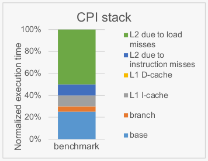

# Memory-Level Parallelism

A computer architect computes a normalized CPI stack for a benchmark workload of interest
on an out-of-order processor with a two-level cache hierarchy in which the L2 cache is a
unified cache holding both data and instructions. The below normalized CPI stack shows
where the processor spends its time:

- 25% of the time is spent executing useful instructions (i.e., base);
- 5% of the time is lost due to branch mispredictions;
- 10% of the time is lost handling L1 I-cache misses;
- No time is lost handling L1 D-cache misses, i.e. the out-of-order processor effectively hides short-latency load misses;
- 10% of time is lost due to instruction misses in the L2 cache;
- 50% of the time is lost due to load misses in the L2 cache.

(a) How much speedup can the computer architect at most obtain by doubling the amount
of memory-level parallelism (MLP)?

We're only looking at data misses, not instruction misses because if we have instruction misses we can't do much of anything.

Memory is 50% of execution time, so we have to halve that part (becomes 25).

$$\frac{100}{100 - (\frac{50}{2})} = \frac{100}{75} = 1.3333...$$

(b) Which of the below design changes should the computer architect consider for
increasing the amount of MLP? Fill in the below table.

| Design change                                   | Yes or No? |
|--------------------|-----------------|
| Make the pipeline deeper                        | No |
| Increase superscalar width                      | Yes, but makes everything more complicated |
| Increase ROB size                               | Yes, getting more data in parallell from memory |
| Increase size of reservation station            | Generally no, but in some situations it might help. If we can _store_ more instructions in the RS it doesn't mean we can _execute_ more instructions as well. |
| Add a hardware prefetcher                       | Yes |
| Increase the number of MSHRs                    | Yes, if you have enough instructions to main memory and previous MSHR couldn't keep up |
| Increase L2 cache size                          | No, it's just more data not more instructions _together_ |
| Devise an improved cache replacement policy in the L2 cache | Yes, if the policy allows more |

(c) Can a more accurate branch predictor also possibly increase the amount of MLP? Yes
or no? Motivate your answer.

**depends how you look at it**
- No, more correct load instructions, but the total number stays the same
- Yes, if you only look at the useful MLP
