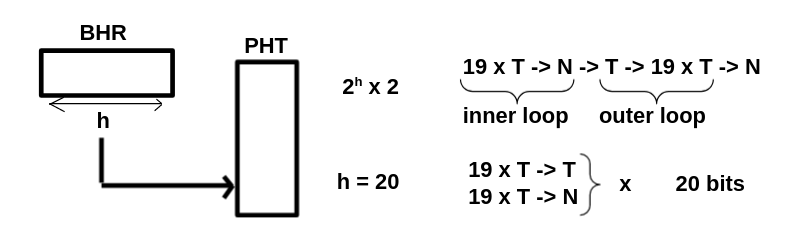

# GAg branch predictor (2)

Consider the following nested loop example:
```
    mov $1000,r2
L1: mov $20,r1
    ...
L2: ...
    dec r1
    bneq r1,L2 (*)
    dec r2
    bneq r2,L1
```

(a) What would be the minimum history length for a GAg predictor to achieve perfect accuracy 
(apart from start-up and end-of-loop effects) 
for the inner-loop branch with the asterisk (*)?


> So 2^20 bits

(b) What fraction of the PHT is accessed while executing the above loop?

You only use 21 of the 2^20 bits.
