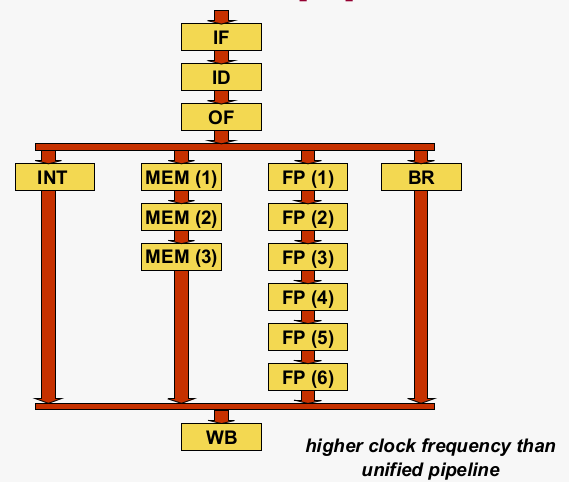

# Superscalar Execution

## Overview
- [Recap: Hazards in instruction pipelines](#recap-hazards-in-instruction-pipelines)
  - [Due to data dependences](#data-dependences)
  - [Due to control dependences](#hazard-due-to-control-dependence)
- [From scalar, to superscalar, to out-of-order](#from-scalar-to-superscalar-to-out-of-order)
  - Diversified pipeline
  - Superscalar pipeline
  - Out-of-order execution
- The out-of-order pipeline

## Recap: Hazards in instruction pipelines

### Instruction Pipeline
Instruction pipeline:
- `IF` Instruction Fetch
- `ID` Instruction Decode
- `OF` Operand Fetch
- `EX` Execute
- `MEM` Memory Read/Write
- `WB` Write Back = Completion = update architecture state

### Program dependences
3 types
- Data dependence through memory
- Data dependence through registers
- Control dependence

Not respecting a program dependence\
=> Hazard\
=> Should not happen!

### Data Dependences
- **Real dependence** = RAW (Read-After-Write)
- **Anti dependence** = WAR (Write-After-Read)
- **Output dependence** = WAW (Write-After-Write)

### Memory dependences
The MEM pipeline stage reads/writes to/from memory
All accessess to memory execute sequentially and in program order

### Register dependences
Hazards?
- Hazard due to WAW register dependence?\
  No, only WB trap writes, and does so sequentially and in program order
- Hazard due to WAR register dependence?\
  No, reading is dont in OF trap writing is done in WB trap
- Hazard dus to RAW register dependence?\
  **Yes**, may happen if an instruction reads an old value from the register file. (Because it hasn't been written yet, but we're already trying to read it)
  - Naive solution: **Pipeline Stall**: stall pipeline until the new value has been written back to the register file
  - Better solution: **Forwarding**: make forwarding paths in hardware (EX to EX, MEM to EX and WB to EX) that forward the new value to the execution trap
 
 ### Hazard due to control dependence
Problem: how do you know the next instruction to be fetched after fetching a control-flow instruction?

### Solution: Branch Prediction & Speculative execution
- Predict the targeet address of the branch
- Start (speculatively) executing instructions along the predicted path

### Upon a correct prediction
No penalty, 0 cycles lost

### Upon a misprecition
Incorrect prediction => Flush wrong-path instructions from pipeline and re-direct fetch

### Cost per mispredicted branch
Cost per mispredicted branch is proportional to pipeline depth (no. pipeline stages)

Example:
|pipeline-stage|x|x+1|x+2|x+3|x+4|x+5|
|-|-|-|-|-|-|-|
If a wrong prediction happends at x, it will only be noticed at x+4 (when it has left the EX trap), so all instructions that are now in the previous stages (IF, ID, OF, EX) need to be flushed. Since the execute stage is in the 4th traph, we have a penalty of 4 cycles.

### Iron Law of Performance (for single-threaded applications)**
**Execution time T = N x CPI x (1/f)**\
with `N the no.insns to execute`, `CPI the avg no. cycles per insn` and `f the clock frequency`

### Optimal pipeline depth
Deeper pipelines:
- Less logic per cycle
- Enables higher clock frequency f
- Leads to higher cost due to mispredictions -> higher CPI

Hence there exists an optimum depth that balances
- Amount of work done per cycle: IPC = 1/CPI
- Number of cycles per second: f

Also: dynamic power consumption increases with clock frequency! (P ~ f^3)\
-> yet another reason why not super-deep pipelines; see later

## From scalar, to superscalar, to out-of-order

### Limitation of a scalar pipeline
- Uifying instruction types is a problem
- Maximum IPC = 1 (instructions per cycle)
- In-order execution

### Problem 1: Unification
EX executes integer and floating-point operations in a single clock cycle.\
Clock frequency is determined by the slowest pipeline stage.\
**Solution: diversification**

#### Diversified pipeline

#### Diversified pipeline introduces three problems
1. Out-of-order completion (writing back results out of program order)
2. Multiple write operations to the register file in the same clock cycle
3. Precise exceptions

#### Out-of-order completion
|R4←ld\[MEM] |IF|ID    |OF    |MEM1  |MEM2  |MEM3  |**WB**|
|----------- |--|--    |--    |----  |----  |------|------|
|**R4←R1+R2**|  |**IF**|**ID**|**OF**|**EX**|**WB**|      |
This is a WAW hazard

#### Solution: enforce in-order completion through pipeline stall
|R4←ld\[MEM] |IF|ID    |OF    |MEM1  |MEM2  |MEM3  |**WB**| |
|----------- |--|--    |--    |----  |----  |------|------|-|
|**R4←R1+R2**|  |**IF**|**ID**|**OF**|xx    |xx    |**EX**|**WB**|      |
the **xx** represents a pipeline stall

#### Multple WBs per cycle
Impossible in case there is only one write port to the register file (RF)\
**Solution**:
**Add write port to register file** or **consider RF write port as a structural hazard (and don't allow for it to happen -> stall pipeline and WB sequentially)**

#### What about exceptions?
OoO (Out-of-order) completion doesn't enable precise exceptions -> may lead to inconsistent state!

Recall: Programmer Visible (Architecture) State
1. Architectural registers: as specified by the instruction-set architecture (ISA)
2. Memory: array of storage locations indexed by an address
3. Program Counter: memory adress of the current instruction

Instruction (and programs) specify how to transform the values of the programmer-visible state

Interrupts vs exceptions (slide 31)
