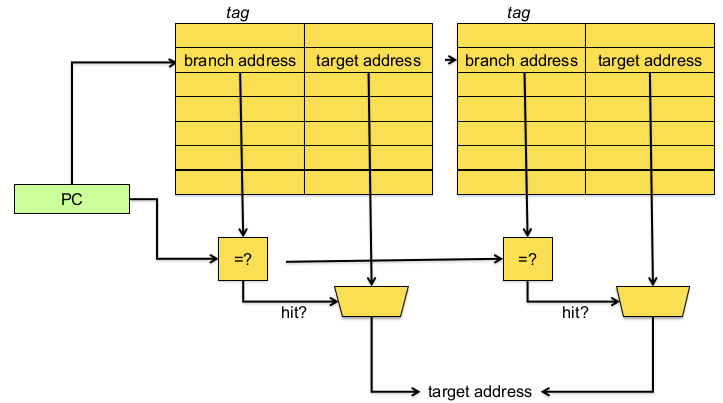

# Branch Prediction

#### The Branch Problem
- Control flow instructions (branchs) are frequent 
  - 15-25% of all instructions
- Problem: Next fetch address after a control-flow instruction is not determined after N cycles in a pipelines processor
  - N cycles: (minimum) branch resolution latency
- If we are fetchinig W instructions per cycle (I.E. if the pipeline is W wide)
  - A branch misprediction leads to N x W wasted instruction slots

#### The Branch Problem: Importance
Assume N = 20 (20 pipeline stages), W = 5 (5 wide fetch)
– Assume: 1 out of 5 instructions is a branch
– Assume: Each 5 instruction-block ends with a branch

How long does it take to fetch 500 instructions?
– 100% accuracy
  - 100 cycles (all instructions fetched on the correct path)
  - **No wasted work**; IPC = 500/100 = 5
– 99% accuracy
  - 100 (correct path) + 20 × 1 (wrong path) = 120 cycles
  - **20% extra instructions fetched**; IPC = 500/120 = 4.17; ~20% longer exec time
– 90% accuracy
  - 100 (correct path) + 20 × 10 (wrong path) = 300 cycles
  - **200% extra instructions fetched**; IPC = 500/300 = 1.67; ~2X longer exec time
– 60% accuracy
  - 100 (correct path) + 20 × 40 (wrong path) = 900 cycles
  - **800% extra instructions fetched**; IPC = 500/900 = 0.55; ~9X longer exec time
 
 #### Control Dependence
 Question: What should the fetch PC be in the next cycle?\
 Answer: The address of the next instruction
 
 All instructions are control dependent on previous ones
 
 If the fetched instruction is a non-control-flow instruction:
 - Next fetch PC is the address of the next-sequential instruction
 - Easy to determine if we know the size of the fetched instruction
 
 If the instruction that is fetched is a control-flow instruction:
 - How do we determine the next fetch PC?
 
 How do we even know whether or not the fetched instruction is a control-flow instruction?
 
 ## Overview
 - [Control-flow instruction types](#control-flow-instruction-types)
 - [Conditional Branch direction prediction](#conditional-branch-direction-prediction)
  - [Static branch prediction](#static-branch-prediction)
  - Dynamic branch prediction
    - Last-time, bimodal
    - History-based
    - Interference: filtering, gshare, gskew
    - Hybrid
    - Further enhancements: loop, perceptron, hybrid history
- How to handle mispredictions?

### Control-Flow Instruction Types
|Type|Direction at fetch time|Number of possible next fetch addresses|When is next fetch address resolved|
|-|-|-|-|
|Conditional branch|Unknown|2|Execution (register dependent)|
|Unconditional branch|Always taken|1|Decode (PC + offset)|
|Call|Always taken|1|Decode (PC + offset)|
|Return|Always taken|Many|Execution (register dependent)|
|Indirect branch/call|Always taken|Many|Execution (register dependent)|

_Different branch types are handled differently_

#### Unconditional branches and function calls
Unconditional branches and function calls are easy to handle: \
Just need to compute the target address

#### Function returns (s9)
Returns are more complicated because there are many possible targets

##### Return Address Stack
- Function call targets are easy to ~~predict~~ compute
- Function returns are much more complicated to predict
  - A function can be called from many different locations
- Solution: Return Address Stack (RAS)
- This is completely in hardware, the only purpose is to predict, the real return instruction will still come from the software return stack

> Why is recursive programming challenging for branch prediction? \
> The RAS will be full pretty quickly, that will lead to a lot of mispredictions when returning

#### Conditional and indirect branches
Most difficult categories of branches to predict

#### How to handle different branch types
**Conditional branch**
- Vast majority of branches (if-then-else, loops, ...)
- Direction unknown -> direction prediction
- Only two possible targets -> next PC or PC + offset

**Indirect branch/call**
- frequently occurring in software written in object-oriented and scripting PLs (virtual function calls, switch statements, ...)
- Many possible targets

#### Conditional branch prediction
Goal is to predict the branch direction and target address, and start fetching and executing instructions along the predicted path

Key observations:
- Branches exhibit temporal locality
- Predicting branch behavior
  - Keep track of past history
  - Predict the future based on the past
- Branch behavior is predictable
  - typically over 90%, 95% or 99% of all dynamically executed branches are correctly predicted using modern-day state-of-the-art branch predictors

Observation: Target address remains the same for a conditional branch across dynamic instances
- Idea: Store the target address from previous instance and access it with the PC
- Branch Target Buffer (BTB) or Branch Target Address Cache (small set-associative cache)

Idea: **Predict the next fetch address (to be used in the next cycle)**

Requires three things to be predicted at fetch stage:
1. Whether the fetched instruction is a branch
2. (Conditional) branch direction
3. Branch target address (if taken)

How?
1. Can be accomplished using a BTB \
   if BTB provides a target address for the program counter, then it must be a branch \
   Or, alternatively, we can store “branch metadata” bits in instruction cache/memory -> partially decoded instruction stored in I-cache
2. How do we predict the direction? \
   **Branch direction prediction**
3. Can be accomplished using a BTB \
    Remember target address computed last time branch was executed

### Conditional branch direction prediction

Static prediction
- Static = before program execution
- One prediction (taken/not-taken) per static branch in the program binary
- Via software: compiler or programmer

Dynamic prediction
- Dynamic = during program execution
- Multiple prediction per static branch, depending on history (= outcomes of prior branch executions) of that particular branch or even other branches
- Done in hardware

#### Static Branch Prediction
Advantages
- Easy to implement
- Little HW is needed

Disadvantages
- Provides the same prediction regardless of input and/or dynamic execution behavior

Three flavors
- [Rule-based](#rule-based-static-branch-prediction)
  - Always taken
  - Always not-taken
  - BTFNT
- [Program-based](#program-based-static-branch-prediction)
- [Profile-based](#profile-based-static-branch-prediction)

##### Rule-based Static Branch Prediction
Always not-taken
- Simple HW: sequential fetch; no BTB needed
- Low accuracy ~30-40% (for conditional branches)

Always taken
- BTB is needed 
- Better accuracy ~60-70% (for conditional branches)
  - Backward branches are usually taken (loop branches)
    - Backward branch: target address is lower than branch PC

BTFNT: Backward Taken - Forward Not-Taken
- Predict backward branches (typically loop branches) as taken; predict others to be not-taken
- BTB is needed; even better accuracy

##### Program-based Static Branch Prediction
Ball en Larus heuristics (1993)
- Requires a hint bit in instruction opcode
- Branch direction is estimated based on program structure
- Examples:
  - Predict backward (loop) branches to be taken
  - When comparing a pointer to NULL, predict branch direction to non-NULL path 
  - When comparing two pointers, predict branch direction to path representing pointer inequality
  - Opcode heuristic: predict BLEZ as not-taken (assumes that negative integer value is error value)
- Typically more accurate than rule-based methods

##### Profile-based Static Branch Prediction
- Execute instrumented binary with a given profile (training) input to collect profile information
  - Count how often a static branch is taken/not-taken
- Use profile information during recompilation and add hint bits
  - Predict taken (i.e. set the hint bit) if branch has higher probability than 50% to be taken; predict not-taken otherwise
- Typically more accurate than rule- and program- based static branch prediction
- Accuracy hinges on whether the profile input is representative for real production inputs

[l2_profile_based_static_branch_prediction.png](l2_profile_based_static_branch_prediction.png)

#### Dynamic branch prediction
- More accurate than static branch prediction
  - 80-97% dynamic vs 50-80% static
  - Requires extra hardware
- Some branhces are hard to predict statically, but are easily predicted dynamically
  - Some examples
    - Not-taken during first half of execution, and taken during second half: TTTTTTTTTNNNNNNNNN
    - Alternating taken/not-taken: TNTNTNTNTNTNTN…
- Takes into account branch context!
  - the branch's own history (local history)
  - other branches' histories (global history)

##### Last-Tme Predictor
Properties:
- Single bit per branch (stored in BTB)
- Indicates which direction branch went last time it executed
  - TTTTTTTTTTNNNNNNNNNN -> 90% accuracy

Always mispredicts the last iteration and the first iteration of a loop branch
- Accuracy for a loop with N iterations = (N-2)/N
- Highly accurate for loops with large N
- Largely inaccurate for loops with small N
  - TNTNTNTNTNTNTNTNTNTN -> 0% accuracy

**Implementation**

[l2_last_time_predictor.png](l2_last_time_predictor.png)

The 1-bit BHT (Branch History Table) entry is updated with the 32 correct outcome after each execution of a branch

**Improvements** \

Problem: A last-time predictor changes its prediction from T->NT or NT->T too quickly
- even though the branch may be mostly taken or mostly not taken (think about a branch at the end of a loop)

Solution: Add hysteresis to the predictor so that prediction does not change on a single different outcome
- Use two bits to track the history of predictions for a branch instead of a single bit

##### Bimodal predictor
**Lookup**

[l2_bimodal_predictor_lookup.png](l2_bimodal_predictor_lookup.png)

**Update**

[l2_bimodal_predictor_update.png](l2_bimodal_predictor_update.png)

