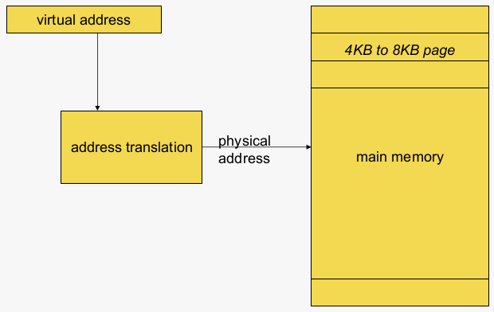
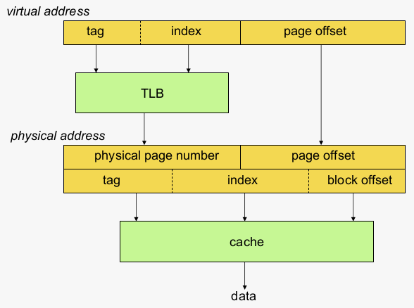
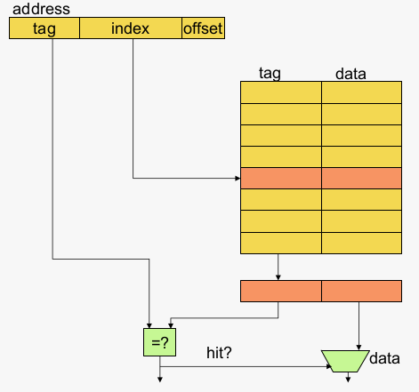
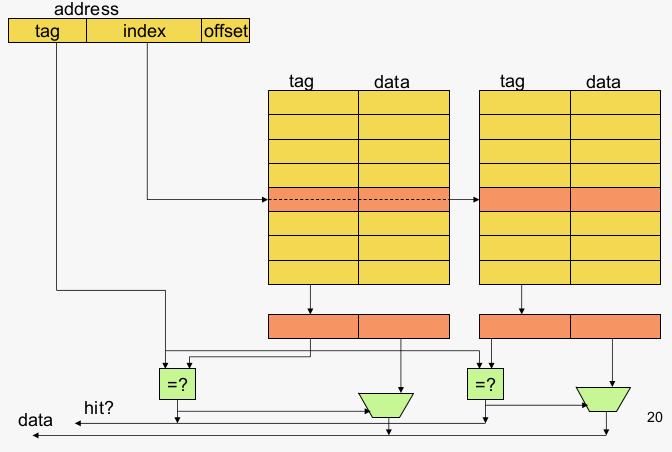
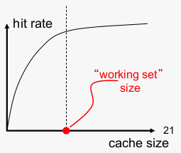
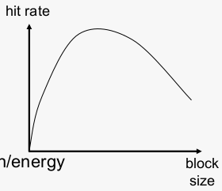

# Memory Hierarchy

## Overview
- [Memory hierarchy fundamentals](#memory-hierarchy-fundamentals)
- [Caching](#caching)
- Memory hierarchy optimizations

## Memory hierarchy fundamentals

### Important concepts
- Locality: spatial, temporal
- Caches: direct-mapped, associative
- Replacement policy (e.g. LRU: least recently used)
- Write-through/back
- Write allocate/non-allocate
- Virtual memory 
- TLB

### Goal of memory hierarchy
- Hide memory latency
- Give the illusion of infinite capacity
- At relatively low cost

### Memory hierarchy
|Component|Technology|Bandwidth|Latency Cost per gigabyte (USD)|
|-|-|-|-|
|**Hard drive**|Magnetic|10+ MB/s|10ms|< 1|
|**Main memory**|DRAM|2+ GB/s|50+ ns|< 200|
|**On-chip L2 cache**|SRAM|10+ GB/s|2+ ns|<100.000|
|**On-chip L1 cache|SRAM**|50+ GB/s|300+ ps|<100.000|
|**Register file**|SRAM with multiple read/write ports|200+ GB/s|300+ ps|>10.000.000 (?)|

### Locality
- Memory hierarchy exploits locality
  - Temporal locality
- Accesses to the same location are likely to occur in near time
  - Spatial locality
- Accesses to nearby locations are likely to occur in near time
  - In both the data and instruction stream
  - Is the case for nearly all computer programs
 
 ### Exploiting locality
 Frequently used data and instructions are stored close to the processor
- In registers
  - done by the compiler
- If not possible, in cache hierarchy (L1, L2, etc.)
  - done by hardware

Infrequently used data and instructions are stored far away from the processor
- Main memory or disk
- Done by the operating system

### Write operations and caches
**Write-through vs write-back**
- Write-through: when writing data to the cache, also write the data to the next level in the hierarchy (L1,L2,L3, cache or main memory)
  - Bandwith hungry
- Write-back: when writing data to the cache, do not write data to the next level in the hierarchy, but mark the cache block as 'dirty'
  - Data is written back upon eviction

**Write-allocate vs. write no-allocate**
- Write-allocate: allocate data in cache
- Write no-allocate: do not allocate in cache

Each level of cache can be either write-through/back and write-allocate/no-allocate

### Typical memory hierarchy
**First level (L1)**
- Split instruction L1 and data L1 caches
  - Why split?
- Small and low associativity
- Access time 1 to 4 clock cycles
- Tag and data array accessed in parallel

**Second level (L2)**
- Unified (instruction and data)
- Larger and higher associativity
- Access time ~10 clock cycles
- Tag and data array accessed serially
- L2 does not see the same accesses as L1
  - L1 acts as a filter (filters some temporal and spatial locality)
  - Management policies are therefore different
 
**Third level (L3)**
- Even larger (4MB to 16MB) and higher associativity
- Typically shared in multi-core processor (see later)
- Acces time ~20 to 30 cycles

**Sometimes fourth level (L4)**
- Off-chip
- For memory-intensive server applications

**Main memory (DRAM)
- 4GB to 1TB
- Uniprocessors 70ns
- In multiprocessor 100ns to 1000ns

### Virtual memory
- Software sees a 32/64-bit address space
- Physical memory, however, is much smaller than the virtual address space
- Virtural memory translates virtual addresses to physical addresses
- Provide the illusion that the complete virtual memory is available in a much smaller physical memory
- And, multiple processes have this same view, calls for time sharing and demanding paging

### Address translation

### Keeping track of page tables
- Forward page tables
- Inverted page tables
  - comes in handy wrt cache coherence (see later)
- TLB
  - Translation Lookaside Buffer
  - Small hardware structure
    - Highly associative w/ typically 64 entries
    - Is essentially a cache for the page tables in memory
  - For both instructions (I-TLB) and data (D-TLB)
  - In case of a TLB miss
    - Read the address translation from the page table in memory
      - Can be done in HW or SW
    - Note that the page table itself may not be in main memory...

### Cache and TLB

### Demanding Paging
- Hardware figures out whether page is available in main memory
- If not, software needs to load the page from disk
  - Takes about 10ms
  - Block the processor? No
  - Generate an exception (page fault)
    - OS schedules the process out
    - OS identifies a page to be replaces
    - OS loads new page from disk, meanwhile other processes run
    - the process is set runnable again

### Memory protection
- Physical memory contains multiple pages from multiple processes
- Process A should not change memory state of process B
  - Although same virtual address, physical address is different
- In particular cases, we may want to process A to change memory state of process B
  - Shared memory between processes or shared livraries
  - Different virtual addresses, same physical address
- certain memory accesses may not be wanted a single process either: protection bits (e.g. read only pages) - see courses on operating systems

## Caching

### Cache
Three possible organizations
- Direct-mapped
- Set-associative
- Fully associative

Size C = S x A x B
- S = #sets
- A = assiociativity
- B = block size

### Direct-mapped cache

### Set-associative cache

### Cache Size
Cache size: total data (not including tag) capacity
- bigger can exploit temoral locallity better
- not always better

Too large a cache adversely affects hit and miss latency
- smaller is faster -> bigger is slower
- access time may degrade critical path

Too small a cache
- does not exploit temporal locality well
- useful data replaced often

Working set: the whole set of data the executing application references (within a time interval)

### Block Size ( = Cacheline Size)
Block size is the data that is associated with an address tag
- Not necessarily the unit of transfer between different levels in cache hierarchy
  - Sub-blocking: a block divided into multiple pieces

Too small blocks
- don't exploit spatial locality well
- have larger tag overhead

Too large blocks
- too few total # of blocks -> less temporal locality exploitation
- waste of cache space and bandwith / energy if spatial locality is not high

### Large Blocks: Critical-Word and subblocking
Large cache blocks can take a long time to fill into the cache
- fill cache line critical word first
- perform cache access before the block is completely filled

Large cache blocks can waste bus bandwidth
- divide a block into sub-blocks
- associate seperate valid bits for each sub-block

> Q: Why do we need valid bits per sub

> Q: Why does it make sense to have dirty bits per sub-block

|v|d|subblock|v|d|subblock|...|vd|subblock|tag|
|-|-|--------|-|-|--------|---|--|--------|---|

### Associativity
How many blocks can map to the same index (or set)?

Larger associativity
- lower miss rate (reduced conflicts)
- higher hit latency and area cost (plus diminishing returns)

Smaller associativity
- lower cost
- lower hit latency
  - espacially important for L1 caches

> Q: Power of two associativity required?

### Miss classification (aka the '3c" model)
**Cold miss or compulsory miss**
- First reference to an address (cacheline) always resultes in a miss
- Subsequent references should hit unless the cache block is replaced for the reason below

**Capacity miss**
- Cache is too small to hold everything needed
- Defined as the misses that would also occur in a fully-associative cache of the same capacity

**Conflict miss**
- Remaining misses: any miss that is neither a compulsory nor capacity miss
- Only occurs in set-associative and direct-mapped caches

### Issues in Set-Associative Caches (slide 26)
