# Branch Prediction

#### The Branch Problem
- Control flow instructions (branchs) are frequent 
  - 15-25% of all instructions
- Problem: Next fetch address after a control-flow instruction is not determined after N cycles in a pipelines processor
  - N cycles: (minimum) branch resolution latency
- If we are fetchinig W instructions per cycle (I.E. if the pipeline is W wide)
  - A branch misprediction leads to N x W wasted instruction slots

#### The Branch Problem: Importance
Assume N = 20 (20 pipeline stages), W = 5 (5 wide fetch)
– Assume: 1 out of 5 instructions is a branch
– Assume: Each 5 instruction-block ends with a branch

How long does it take to fetch 500 instructions?
– 100% accuracy
  - 100 cycles (all instructions fetched on the correct path)
  - **No wasted work**; IPC = 500/100 = 5
– 99% accuracy
  - 100 (correct path) + 20 × 1 (wrong path) = 120 cycles
  - **20% extra instructions fetched**; IPC = 500/120 = 4.17; ~20% longer exec time
– 90% accuracy
  - 100 (correct path) + 20 × 10 (wrong path) = 300 cycles
  - **200% extra instructions fetched**; IPC = 500/300 = 1.67; ~2X longer exec time
– 60% accuracy
  - 100 (correct path) + 20 × 40 (wrong path) = 900 cycles
  - **800% extra instructions fetched**; IPC = 500/900 = 0.55; ~9X longer exec time
 
 #### Control Dependence
 Question: What should the fetch PC be in the next cycle?\
 Answer: The address of the next instruction
 
 All instructions are control dependent on previous ones
 
 If the fetched instruction is a non-control-flow instruction:
 - Next fetch PC is the address of the next-sequential instruction
 - Easy to determine if we know the size of the fetched instruction
 
 If the instruction that is fetched is a control-flow instruction:
 - How do we determine the next fetch PC?
 
 How do we even know whether or not the fetched instruction is a control-flow instruction?
 
 ## Overview
 - [Control-flow instruction types](#control-flow-instruction-types)
 - [Conditional Branch direction prediction](#conditional-branch-direction-prediction)
  - [Static branch prediction](#static-branch-prediction)
  - [Dynamic branch prediction](#dynamic-branch-prediction)
    - [Last-time](#last-tme-predictor), [bimodal](#bimodal-predictor)
    - [History-based](#history-based)
    - Interference: filtering, gshare, gskew
    - Hybrid
    - Further enhancements: loop, perceptron, hybrid history
- [How to handle mispredictions?](#how-to-handle-mispredictions)

### Control-Flow Instruction Types
|Type|Direction at fetch time|Number of possible next fetch addresses|When is next fetch address resolved|
|-|-|-|-|
|Conditional branch|Unknown|2|Execution (register dependent)|
|Unconditional branch|Always taken|1|Decode (PC + offset)|
|Call|Always taken|1|Decode (PC + offset)|
|Return|Always taken|Many|Execution (register dependent)|
|Indirect branch/call|Always taken|Many|Execution (register dependent)|

_Different branch types are handled differently_

#### Unconditional branches and function calls
Unconditional branches and function calls are easy to handle: \
Just need to compute the target address

#### Function returns (s9)
Returns are more complicated because there are many possible targets

##### Return Address Stack
- Function call targets are easy to ~~predict~~ compute
- Function returns are much more complicated to predict
  - A function can be called from many different locations
- Solution: Return Address Stack (RAS)
- This is completely in hardware, the only purpose is to predict, the real return instruction will still come from the software return stack

> Why is recursive programming challenging for branch prediction? \
> The RAS will be full pretty quickly, that will lead to a lot of mispredictions when returning

#### Conditional and indirect branches
Most difficult categories of branches to predict

#### How to handle different branch types
**Conditional branch**
- Vast majority of branches (if-then-else, loops, ...)
- Direction unknown -> direction prediction
- Only two possible targets -> next PC or PC + offset

**Indirect branch/call**
- frequently occurring in software written in object-oriented and scripting PLs (virtual function calls, switch statements, ...)
- Many possible targets

#### Conditional branch prediction
Goal is to predict the branch direction and target address, and start fetching and executing instructions along the predicted path

Key observations:
- Branches exhibit temporal locality
- Predicting branch behavior
  - Keep track of past history
  - Predict the future based on the past
- Branch behavior is predictable
  - typically over 90%, 95% or 99% of all dynamically executed branches are correctly predicted using modern-day state-of-the-art branch predictors

Observation: Target address remains the same for a conditional branch across dynamic instances
- Idea: Store the target address from previous instance and access it with the PC
- Branch Target Buffer (BTB) or Branch Target Address Cache (small set-associative cache)


Idea: **Predict the next fetch address (to be used in the next cycle)**

Requires three things to be predicted at fetch stage:
1. Whether the fetched instruction is a branch
2. (Conditional) branch direction
3. Branch target address (if taken)

How?
1. Can be accomplished using a BTB \
   if BTB provides a target address for the program counter, then it must be a branch \
   Or, alternatively, we can store “branch metadata” bits in instruction cache/memory -> partially decoded instruction stored in I-cache
2. How do we predict the direction? \
   **Branch direction prediction**
3. Can be accomplished using a BTB \
    Remember target address computed last time branch was executed

### Conditional branch direction prediction

Static prediction
- Static = before program execution
- One prediction (taken/not-taken) per static branch in the program binary
- Via software: compiler or programmer

Dynamic prediction
- Dynamic = during program execution
- Multiple prediction per static branch, depending on history (= outcomes of prior branch executions) of that particular branch or even other branches
- Done in hardware

#### Static Branch Prediction
Advantages
- Easy to implement
- Little HW is needed

Disadvantages
- Provides the same prediction regardless of input and/or dynamic execution behavior

Three flavors
- [Rule-based](#rule-based-static-branch-prediction)
  - Always taken
  - Always not-taken
  - BTFNT
- [Program-based](#program-based-static-branch-prediction)
- [Profile-based](#profile-based-static-branch-prediction)

##### Rule-based Static Branch Prediction
Always not-taken
- Simple HW: sequential fetch; no BTB needed
- Low accuracy ~30-40% (for conditional branches)

Always taken
- BTB is needed 
- Better accuracy ~60-70% (for conditional branches)
  - Backward branches are usually taken (loop branches)
    - Backward branch: target address is lower than branch PC

BTFNT: Backward Taken - Forward Not-Taken
- Predict backward branches (typically loop branches) as taken; predict others to be not-taken
- BTB is needed; even better accuracy

##### Program-based Static Branch Prediction
Ball en Larus heuristics (1993)
- Requires a hint bit in instruction opcode
- Branch direction is estimated based on program structure
- Examples:
  - Predict backward (loop) branches to be taken
  - When comparing a pointer to NULL, predict branch direction to non-NULL path 
  - When comparing two pointers, predict branch direction to path representing pointer inequality
  - Opcode heuristic: predict BLEZ as not-taken (assumes that negative integer value is error value)
- Typically more accurate than rule-based methods

##### Profile-based Static Branch Prediction
- Execute instrumented binary with a given profile (training) input to collect profile information
  - Count how often a static branch is taken/not-taken
- Use profile information during recompilation and add hint bits
  - Predict taken (i.e. set the hint bit) if branch has higher probability than 50% to be taken; predict not-taken otherwise
- Typically more accurate than rule- and program- based static branch prediction
- Accuracy hinges on whether the profile input is representative for real production inputs

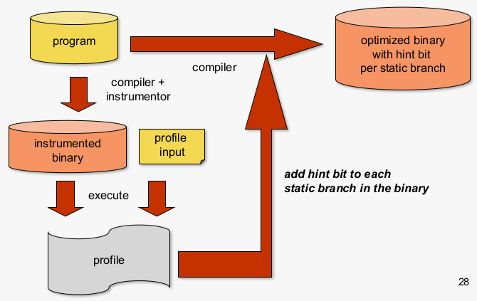

#### Dynamic branch prediction
- More accurate than static branch prediction
  - 80-97% dynamic vs 50-80% static
  - Requires extra hardware
- Some branhces are hard to predict statically, but are easily predicted dynamically
  - Some examples
    - Not-taken during first half of execution, and taken during second half: TTTTTTTTTNNNNNNNNN
    - Alternating taken/not-taken: TNTNTNTNTNTNTN…
- Takes into account branch context!
  - the branch's own history (local history)
  - other branches' histories (global history)

##### Last-Tme Predictor
Properties:
- Single bit per branch (stored in BTB)
- Indicates which direction branch went last time it executed
  - TTTTTTTTTTNNNNNNNNNN -> 90% accuracy

Always mispredicts the last iteration and the first iteration of a loop branch
- Accuracy for a loop with N iterations = (N-2)/N
- Highly accurate for loops with large N
- Largely inaccurate for loops with small N
  - TNTNTNTNTNTNTNTNTNTN -> 0% accuracy

**Implementation**

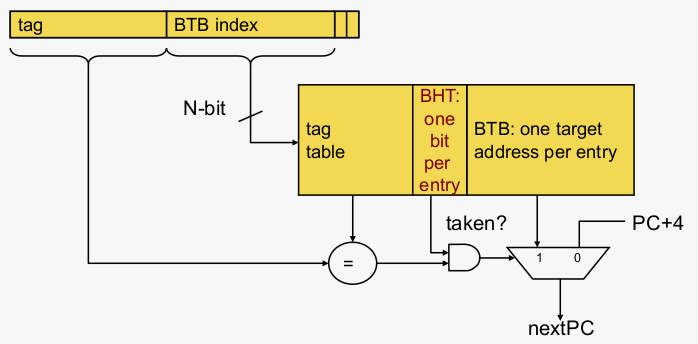

The 1-bit BHT (Branch History Table) entry is updated with the 32 correct outcome after each execution of a branch

**Improvements**

Problem: A last-time predictor changes its prediction from T->NT or NT->T too quickly
- even though the branch may be mostly taken or mostly not taken (think about a branch at the end of a loop)

Solution: Add hysteresis to the predictor so that prediction does not change on a single different outcome
- Use two bits to track the history of predictions for a branch instead of a single bit

##### Bimodal predictor
**Lookup**

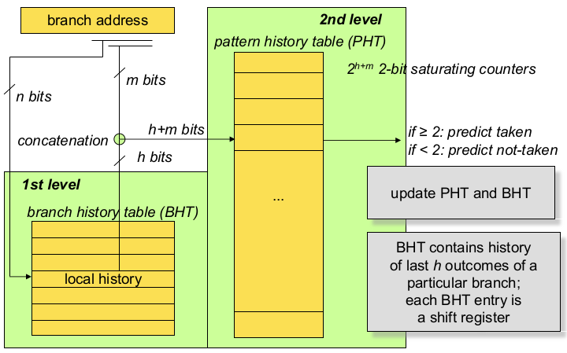

**Update**

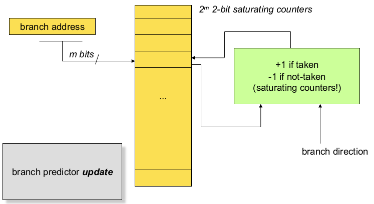

**Example**

|current state|prediction|actual direction|new state|
|-|-|-|-|
|00|0|0|00|
|00|0|0|00|
|00|0|1|01|
|01|0|1|10|
|10|1|1|11|
|11|1|1|11|
|11|1|0|10|
|10|1|1|11|
|11|1|1|11|
|11|1|0|10|
|10|1|0|01|

#### History based

##### Can We do better: two-level prediction
Last-time and bimodal predictors exploit last-time predictability

**Global branch correlation** \
A branch's outcome can be correlated with other branches' outcomes

**Local branch correlation** \
A branch's outcome can be correlated with past outcomes of the same static branch (other than the outcome of the branch "last-time" it was executed)

##### Two-level predictors
*Correlating branch predictor* \
Use branch history to make a prediction
- Last-time and bimodal predictors only use the branch address
- Two-level predictors in addition use
  - Local history of that particular branch, or
  - Global history of all prior branches
  - history = outcome of prior branch executions
  - history acts as a shift register (FIFO queue): newest branch outcome is inserted; oldest branch outcome is discarded

Analyze the past to predict the future

##### Global History: intuition
Correlation among branches
- For example, if a particular branch is taken (not-taken), probability may be high that another future branch is also taken (not-taken)

Concrete examples
- Branch conditions that depend on the same variable
- A variable is control dependent on branch; a subsequent branch is data dependent on the variable -> both branches will be correlated

**Global Branch Correlation** \
Recently executed branch outcomes in the execution path are correlated with the outcome of the next branch

*Example 1* if first not taken, second also not taken
```
if (cond1)
...
if (cond1 and cond2)
```
*Example 2* if first taken, second not taken
```
if (cond1) a=2;
if (a == 0)
...
```
*Example 3* if first and second both taken, then third also taken (if first or second not taken, third not taken)
```
if (cond1)
...
if (cond2)
...
if (cond1 and cond2)
```
##### Capturing Global branch Correlation
idea: Associate branch outcomes with 'global T/NT) history' of all branches

Make a prediction based on the outcome of the branch the last time the same global branch history was encountered

Implementation:
- Keep track of the global T/N history of all branches in a register -> (BHR) Branch History Register
- Use BHR to index into a table that records the outcome that was seen for each BHR value in the recent past -> (PHT) Pattern History Table (table of 2-bit counters)

Uses two levels of history: BHR + history at that BHR

##### Global History Based Prediction

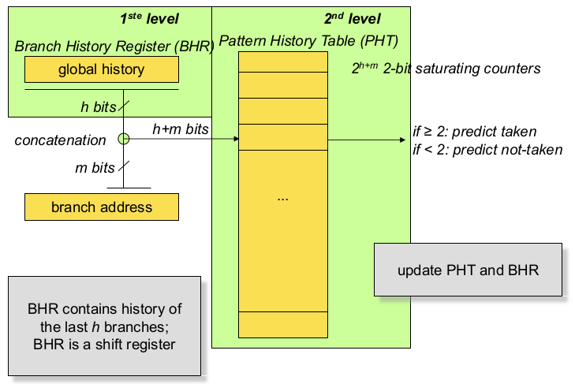

**Example**

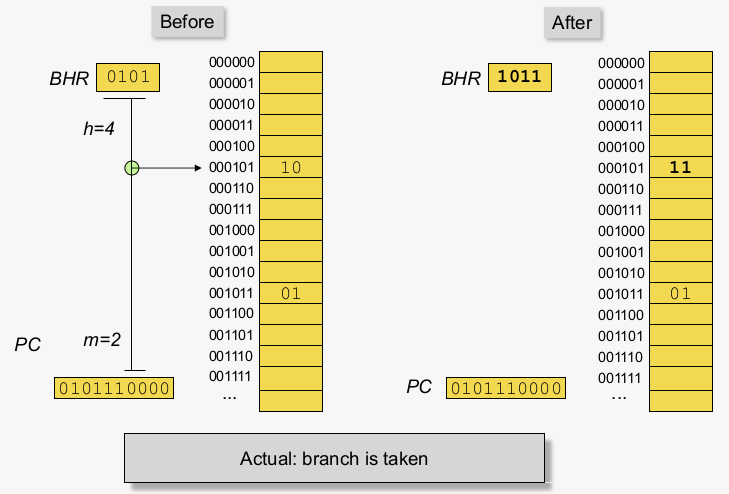

##### Local Branch Correlation
```
for (i=0 ; i<4 ; i++) { ... }
```
If the loop test is done at the end of the body, the corresponding branch will execute the pattern 1110 n times (1=Taken, 0=Not-Taken, n=number of times the loop is executed) \
Clearly, if we knew the direction this branch had gone in the three previous executions, then we would always be able to predict the next execution.

To predict a loop branch "perfectly" we want to identify the last iteration of the loop. \
By having a seperate PHT entry for each local history, we can distinguish different iterations of a loop. \
Works for "short" loops

##### Capturing Local Branch Correlation
Idea: have a per-branch history register
- Associate the predicted outcome of a branch with T/NT history of the same branch

Make a prediction based on the outcome of the branch the last time the same local branch history was encountered

Uses two levels of history
- per-branch history register 
- history at that history register value

##### Local History Based Prediction


**Example**

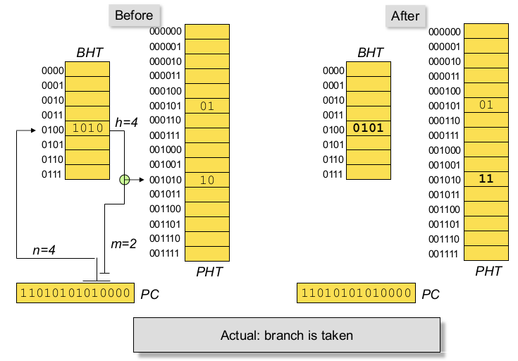

#### Two-Level Branch Predictor Taxonomy
- if m==0
  - Global pattern history table (gPHT)
  - No address bits are used to index the PHT
  - In other owrds, all branches share the same PHT
    - Hence the PHT is global to all branches
- if m != 0
  - Per-address pattern history table (pPHT)
  - A couple (m) bits are used to index the PHT
  - PHT is partitioned based on branch address bits
    - Hence, the PHT is partitioned across the branches
- Four variations: GAg, GAp, PAg, PAp
  - G: global history / P: per-address (local
  - A adaptive
  - g -> gPHT and p -> pPHT

### Good configurations
- Obtained through experimental evaluation
- GAG
  - BHR: 18 bits
  - PHT: 2^18 x 2 bits
- PAg
  - BHT: 2^11 x 12 bits
  - PHT: 2^12 x 2 bits
- PAp
  -  BHT: 2^11 x 6 bits
  -  PHT: 2^9 x 2^6 x 2 biµ- Prediction accuracy of 97%

### Issue: Interference in the PHT
SHaring the PHT across branches / histories leads to interference
- Different branches map to the same PHT entry and modify it
- Interference can be positive, negative, or neutral

Interference can be eliminated by dedicating a PHT per branch
- Too much hardware cost

How else can we eliminate or reduce interference


### Reducing Interference in PHT
Increase size of PHT

Branch filtering
- Predict highly-biased branches separately so that they do not consume PHT entries
- E.g. static prediction or BTB-based prediction

Hashing / index-randomization
- Gshare
- Gskew

### Branch Filtering
**Observation**: Many branches are biased in one direction (e.g. 99% taken)

**Problem**: These branches 'pollute' the branch prediction structures -> make the prediction of other branches difficult by causing 'interference' in branch prediction tables and history register

**Solution**: Detect such biased branches, and predict them with a simpler prediction (e.g. last time, static, ...)

### Gshare
Randomize the indexing function into the PHT such that probability of two branches mappng to the same entry reduces

**Gshare predictor**: global branch history register hashed with the branch address

Benefits:
- Better utilization of PHT
- More context to predict branches
Drawback:
- Increased access latency

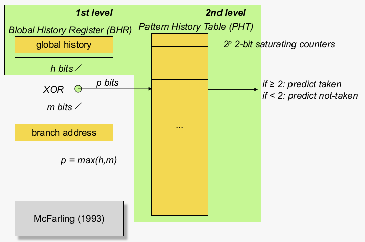

### GAp vs Gshare 
GAp (remember: m != 0) needs to make a choice
- how many bits to concatenate from BHR vs branch address?
- e.g. 5 bits from BHR and 5 bits from branch address

gshare doesn't need to make this choice
- e.g. 10 bits from BHR and 10 bits from branch address
- More context to index the PHT
- Less interference in PHT

### Two-Level Gshare Branch Predictor

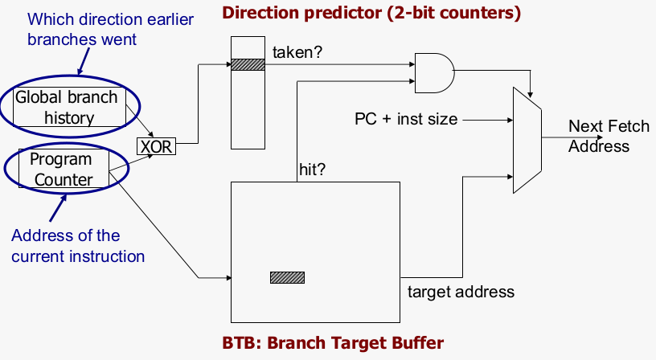

### Pshare: Randomize PHT Index in Local Predictor

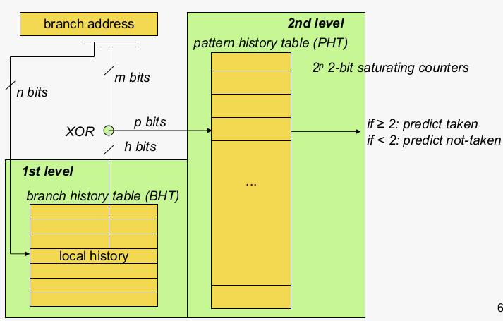

### Reducing interference: Gskew
Multiple PHTs \
Each indexed with a different type of hash function
Final prediction is a majority vote

Benefit: gskew distributes interference patterns in a more randomized way (interfering patterns less likely in different PHTs at the same time)

Downside: High HW complexity (due to multiple PHTs, hash functions)

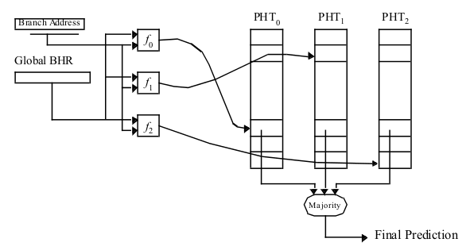

### Cant we do even better?
**Predictability of some branches varies**
- Some branches are more predictable using local history
- Some using global
- For others, a simple two-bit counters is enough
- Yet for others, a bit is enough

**Observation**: there is heterogeneity in predictability behavior of branches
- No one-size fits all branch prediction algorithms for all branches

**Idea**: exploit that heterogeneity by designing hybrid or tournament branch predictor

### Hybrid Branch Prediction
Use more than one type of predictor (i.e. multiple algorithms) and select the 'best' prediction
- Combine different types of branch predictors and learn which one is most accurate for which branch
- e.g. hybrid of 2-bit counters and global predictor

**Advantages**:
- Better accuracy: different predictors are better for different branches
- Reduced warmup time (faster-warmup predictor used until the slower-warmup predictor warms up) when context switching in multitasking environment

**Disadvantages**:
- Need 'meta-predictor' or 'selector'
- Increased access latency

### Tournament predictor


- Meta predictor determines which predictor will be followed
  - If < 2 -> P1 ; If >= 2 -> P2
- Update meta predictor
  - If both correct or incorrect: do nothing
  - If P1 is correct and P2 incorrect: decrement
  - if P1 is incorrect and P2 is correct: increment
- Both predictors are updated
  - Irrespective of whether P1 or P2 was followed
- Various flavors exist
- Anh predictor can be part of a hybrid predictor
- Indexing of meta predictor is to be chosen
  - e.g. branch address (as for bimodal)
  - e.g. global history (as for gshare)
- Hybrid predictor typically combines local and global history based predictors

### Are we done with branch prediction.
Hybrid branch predictors work well
- e.g. 90%-97% prediction accuracy on average

Some "difficult" workloads still suffer, though!

### Some other branch predictor types
**Loop branch detector and predictor**
- Loop iteration count detector/predictor
- Works well for loops with small number of iterations, where iteration count is predictable

**Perceptron branch predictor**
- Learns the direction correlations between individual branches
- Assigns weights to correlations

**Hybrid history length based predictor**
- Uses different tables with different history lengths

### Perceptron Branch Predictor
idea: use a preceptron to learn the correlations between between branch history register bits and branch outcome \
**A perceptron learns a target Boolean function of N inputs**

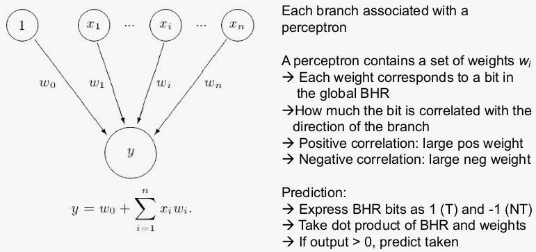

**Advantages**
- More sophisticated learning mechanism -> better accuracy

**Disadvantages**
- Hard to implement (adder tree to compute perceptron output)
- Can learn only linearly-separable functions
  - e.g. cannot learn XOR type of correlation between history bits and branch outcome

### TAGE: Prediction Using Multiple History Lengths

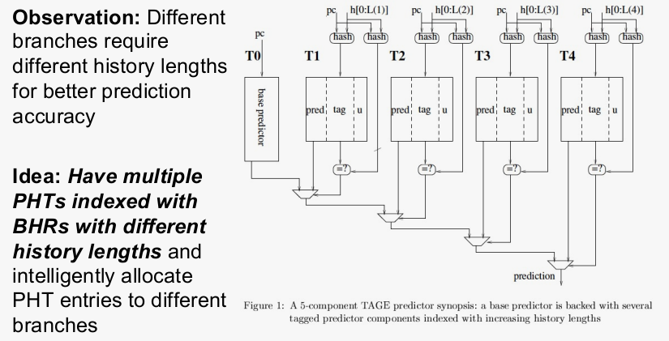

## How to handle misprediction

### Speculative execution
- predict branch target address and start fetching and executing instructions along the predicted path
  - Remember though: no completion of speculative instructions!
  - Speculative executed instructions do not update architecture state
- There might be multiple branches in flight along the predicted path
  - Instructions are labeled using tags
  - Tag IDs are incremented when a branch is fetched

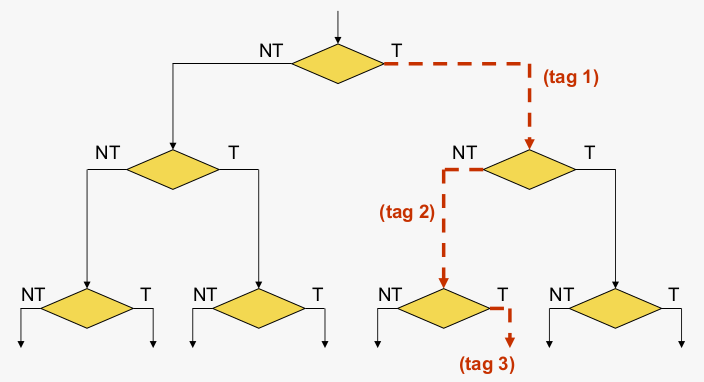

### Pipeline squashing
- Branch outcome is known at execution stage
- If correctly predicted
  - Corresponding tags are deallocated
  - Instructions become non-speculative
- If mispredicted
  - Wrong-path instructions are nullified (squashed)
    - Hardware resources are deallocated (this includes ROB entries, issue buffer entries, physical registers, etc)
  - Redirect fetch (instantiate the correct PC) and start fetching instructions along correct path

