# Out-of-Order Execution

### Recap: OoO pipeline

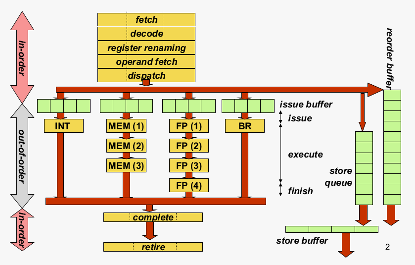

# Overview
- [Register renaming](#register-renaming)
  - [Principle](#principle)
  - [Implementation](#implementation)
- [Out-of-order execution](#out-of-order-execution)
  - [Data flow execution principle](#data-flow-execution-principle)
  - [Hardware implementation](#hardware-implementation)
- [Breaking the data flow limit](#breaking-the-data-flow-limit)
- [Memory operations in an OoO processor](#memory-operations-in-an-ooo-processor)

# Register renaming
## Principle
- Goal: remova anti- and output dependences through registers; only real data dependences through registers remain
- By doing so, we archieve the 'data flow limit'
- Architectural registers are renamed to physical/rename registers
- **A physical register is written at most once by an 'in-flight' instruction**
  - **this enables data flow execution through only real data dependences**
- Done completely in HW
  - Don't confuse this with register allocation in the compiler (register allocation: assigning large number of target program variables onto a small number of architectural registers)

every instruction receives a unique target physical register

### Architectural to physical register mapping

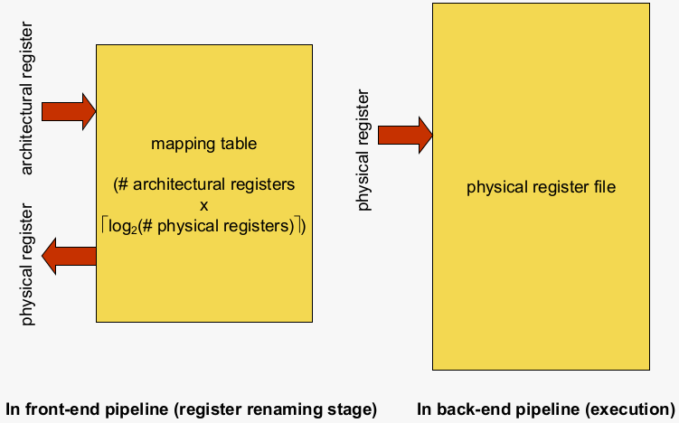

### Finit State Machine (FSM) per physcial register

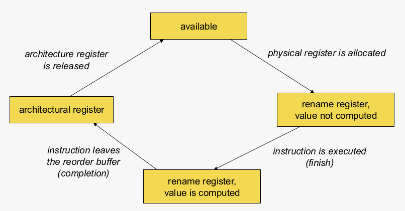

## Implementation

- Initialization
  - All physical registers that map to architectural registers are in the 'architectural register' state
  - All other physical registers are 'available'
- An instruction's input operand(s)
  - Read the physical register that corresponds with the architectural register from the mapping table
- Output operand
  - Select an 'available' physical regiser, and change the state to 'rename register, value not computed'; updatethe mapping table
  - In case there are no more 'available' physical registers, stall the pipeline until physical register become available
- When an instruction finishes its execution on a functional unit --finish
  - Change state to 'rename register, value computed'
- When an instruction leaves the ROB --completion
  - (i) change state of the physical target register to 'architectural register' AND
  - (ii) the physical register previously associated with that same architecture register changes its state to 'available'
    - Old valu is no longer needed (for sure!)
    - (This previous architectural-to-physical register mapping is kept track of in the ROB ; see later)

### Example
AR = architectural register \
AV = available \
RR = rename register

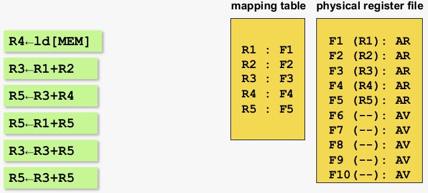

**Instruction 1**

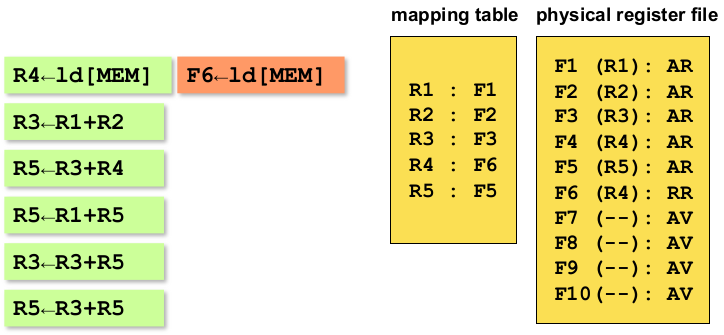

**Instruction 2**

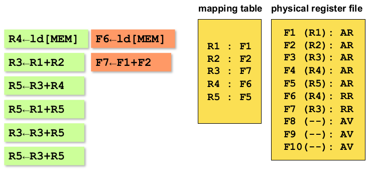

**Instruction 3**

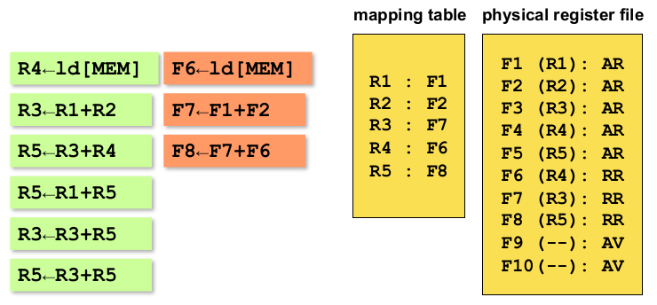

**Instruction 4**

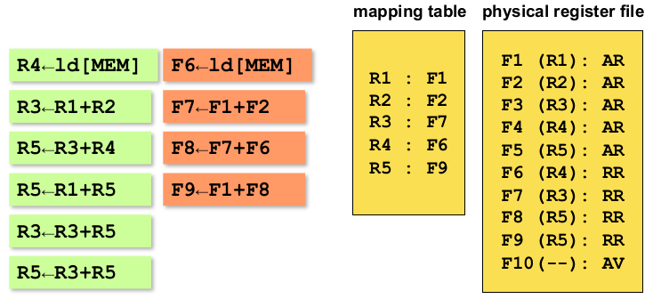

**Instruction 5**

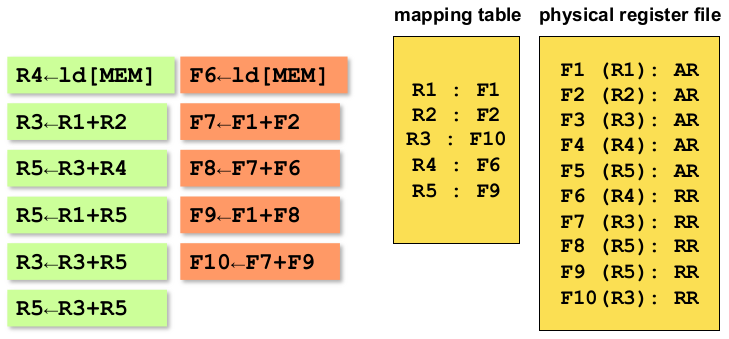

Register renaming now blocks because there are no more physical register available

Assume the first two instructions leave the ROB ...

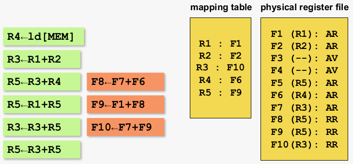

**Instruction 6**

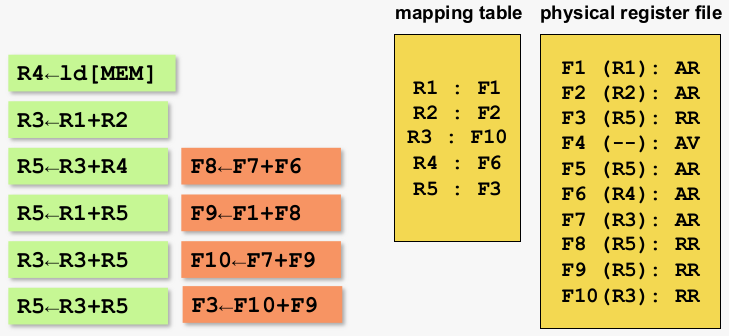

# Out-of-order execution
## Data flow execution principle
## Hardware implementation

# Breaking the data flow limit

# Memory operations in an OoO processor]
