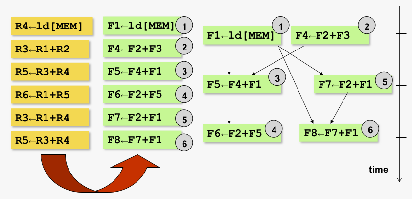

# Out-of-Order Execution

### Recap: OoO pipeline

# Overview
- [Register renaming](#register-renaming)
  - [Principle](#principle)
  - [Implementation](#implementation)
- [Out-of-order execution](#out-of-order-execution)
  - [Data flow execution principle](#data-flow-execution-principle)
  - [Hardware implementation](#hardware-implementation)
- [Breaking the data flow limit](#breaking-the-data-flow-limit)
- [Memory operations in an OoO processor](#memory-operations-in-an-ooo-processor)

# Register renaming
## Principle
- Goal: remova anti- and output dependences through registers; only real data dependences through registers remain
- By doing so, we archieve the 'data flow limit'
- Architectural registers are renamed to physical/rename registers
- **A physical register is written at most once by an 'in-flight' instruction**
  - **this enables data flow execution through only real data dependences**
- Done completely in HW
  - Don't confuse this with register allocation in the compiler (register allocation: assigning large number of target program variables onto a small number of architectural registers)

every instruction receives a unique target physical register

### Architectural to physical register mapping

### Finit State Machine (FSM) per physcial register

## Implementation

- Initialization
  - All physical registers that map to architectural registers are in the 'architectural register' state
  - All other physical registers are 'available'
- An instruction's input operand(s)
  - Read the physical register that corresponds with the architectural register from the mapping table
- Output operand
  - Select an 'available' physical regiser, and change the state to 'rename register, value not computed'; updatethe mapping table
  - In case there are no more 'available' physical registers, stall the pipeline until physical register become available
- When an instruction finishes its execution on a functional unit --finish
  - Change state to 'rename register, value computed'
- When an instruction leaves the ROB --completion
  - (i) change state of the physical target register to 'architectural register' AND
  - (ii) the physical register previously associated with that same architecture register changes its state to 'available'
    - Old valu is no longer needed (for sure!)
    - (This previous architectural-to-physical register mapping is kept track of in the ROB ; see later)

### Example
AR = architectural register \
AV = available \
RR = rename register

**Instruction 1**

**Instruction 2**

**Instruction 3**

**Instruction 4**

**Instruction 5**

Register renaming now blocks because there are no more physical register available

Assume the first two instructions leave the ROB ...

**Instruction 6**

# Out-of-order execution

## Data flow execution principle

### Renaming and dispatch
- Register renaming is done in front-end of the pipeline
  - Only RAW dependences through physical registers remain in the back-end pipeline
  - happens before dispatch
- Dispatch
  - Allocate entry and insert instruction in reservation station (issue buffer)
  - Allocate entry and insert instruction in reorder buffer (ROB)
  - In case no more empty entries in issue buffer OR reorder buffer, stall the front-end pipeline (all stages from fetch to dispatch)

### Reservation station = issue buffer
- Buffering of insns that wait for their input operands; once the operands are available, insns are issued to a functional unit
- Instruction waits for its input operands
  - (recall: only RAW dependences!)
  - Either available from the OF stage
  - Or, the value still needs to be produced
- An instruction leaves the issue buffer when issued or when executed
- Issue buffer decouples front-end from back-end of the pipeline

### Reservation station: How it works
- Insns wait untill all input operands are available (ready_bit == 1)
- If ready and FU is available, fire instruction and start its execution --issue
- When execution is doen --finish-- put the target register ID and the result on the (forwarding) bus
- Instruction 'watch' the result vus for available regisers

### Example

**Cycle 1 @ issue**

**Cycle 1 @ finish**

**Cycle 2 @ issue**

**Cycle 2 @ finish**

**Cycle 3 @ issue**

**Cycle 3 @ finish**

**Cycle 4 @ issue**

## Hardware implementation
- [Instruction wake-up](#instruction-wake-up)
- [Precise exceptions](#precise-exceptions)
- [Non-data captured organization](#non-data-captured-organization)

### Reservation station (RS) entry

### Instruction wake-up
Complex logix

Content-Adressable Memory (CAM)

### Recap: RAM vs CAM

### Dynamic instruction selection
Instruction can be selected for execution if all input operands are available (ready = 1)

In case more than one instruction is ready to execute
- Select oldest-first
- Other insns wait till next cycle

### Reorder buffer
Contains all in-flight instructions
- This includes all instructions after dispatch and before completion
- Insns in issue buffer(s) is a subset of the insns in the ROB

**ROB entry**

- Circular buffer with head and tail pointer
- number of instructions inserted in the ROB per cycle is limited by the dispatch width
  - Dispatch happens at the tail
  - Recall: In-order dispatch
- Number instructions leaving the ROB per cycle is limited by the completion width
  - Completion happens at the head
  - Recall: In-order completion
  - Head pointer oints to the next-to-complete instruction
- Tail pointer can never surpass the head pointer

### Reorder buffer vs reservation station
**Reorder buffer**
- Contains all in-flight instructions
- From dispatch till completion

**Reservation station**
- Contains only instruction that have not been issued yet (or are being executed)
- From dispatch till finish
- Is subset of instruction in the ROB

### Instruction window
ROB and reservation station can be combined into one structure, called the instruction window
- was done in the first out-of-order processors

Disadvantages: HW complexity and energy inefficiency
- ROB contains both ready and not-yet-ready instructions
- Recall: long wires for wake-up
- So: wires are unnecessarily long, too many comparators

Most modern out-of-order processors use an ROB and reservation stations
- Reduced HW cost and reduced energy consumption

### Precise exceptions
**Precise exceptions**
- Recall: save architecture state prior to the exception; handle the exception; restart execution from the instruction that caused the exception

**How to guarantee precise exceptions in OoO processor?**
- Recall: ROB with in-order completion
- Instructions that generate an exception are set a flag in their ROB entry; insns prior to the excepting insn can complete in program order; exception is detected when the excepting insn is about to be completed
- Save architecture state and handle exception

### What about register renaming upon an exception?

### What about mispredicted branches?
- Same principle
  - Mapping between architectural and physical registers needs to be restored to the state just after the branch
- Can be implemented the same way as for exceptions
  - Restoring mapping table is sequential process
    - Acceptable if this is a rare event only
  - Mispredicted branches are (way) more frequent than exceptions, hence...
- A more efficient solution: checkpointing
  - Take a snapshot of the mapping table after each branch
  - Restore the mapping table from the snapshot upon a mispredicted branch

### Non-data captured organization
**Recap: reservation station**

Each RS entry holds operand register values
- some (many?) register values may appear multiple times
- may lead to long wires (high power; long wires do not scale well with chip technology nodes)

**This is called a data-captured organization** \
Disadvantage: replicated register alues

Advantage: only one copy of register value in PRF + reduced HW cost in reservation station

### But... No free lunch
We want to execute data-dependent instructions back-to-back in subsequent cycles and we want high clock frequency

This requires that we
- select rready instructions
- access the PRF to get the register values
- execute instructions on FUs
- write back results to PRF and distribute tags across the reservation station (wake-up)

in ONE clock cycle... -> low clock speed...

Can we pipeline this design and run at higher clock speed?

### Pipelined organization
employed in most modern-day OoO processors

### Example

**Cycle 0**

**Cycle 1**

**Cycle 2**

**Cycle 3**

**Cycle 4**

**Cycle 5**

# Breaking the data flow limit

### Is the data flow limit the real limit?
- Recall: register renaming removes all non-real data register dependences
- This leads to the data flow limit
- "It's impossible to break this limt"
- Research was done to break this limit
  - Value prediction

### Value prediction
**Key idea:**
- predict the outcome of operations in pipeline front-end
- start speculatively executing dependent instructions based on predicted values
- verify is prediction is correct
  - if correct: good, improved performance as we execute instructions earlier
  - if incorrect: we need to roll back (performance hit)

**Benefit**: no need to wait for the result to be computed, hence dependent insns can execute sooner

**Speculative technique**: prediction needs to be verified
 - if incorrect: restore state and re-execute

### Why does it work?
**Value locality**
- Some insns repeatedly generate the same value
- Other insns generate easy-to-predict patterns
- Examples: loop iterator (i++), reading a constant value from memory, initialization, strided memory accesses (e.g. walking through an array), etc

**Implementation**: keep track of old value (and stride or delta between two consecutive values) produced by an insn, to predict future values

# Memory operations in an OoO processor

### Memory operation
Three steps to execute a memory operation:
- Address calculation
  - Typically: addition of register value with offset
  - Done in the virtual address space
- Address translation
  - From virtual address to physical address
- Memory access
  - Read (in case of a load) or write (in case of a store) the memory location

### Loads/stores in OoO processor
**Load** needs to wait for the register with the address info

**Store** needs to wait for two register
- register to compute the address
- register to be stored in memory

pipelined execution on FU
- First stage: address calculation
- Second stage: address translation
  - Access TLB (may lead to a TLB miss, etc)
- Third stage
  - Load: read value from cache/memory and write to a register
  - Store: write value to store queue
    - is later wirtten into store buffer upon completion
    - is yet later written to cache/memory upon retirement

### Loads/stores vs speculative execution and OoO execution
**Control dependences**
- How to handle loads and stores in the context of speculative execution? How do we make sure loads and stores do not update architecture state if those loads and stores are along mispredicted paths

**Data dependences**
- How to handle OoO execution of loads and stores and make sure we are not violating RAW data dependences through memory?

### Loads/stores vs control dependences
**Observation**: loads and stores may execute on ALU before earlier branches in an OoO processor

Doesn't seem like a problem if branch turns out to be correctly predicted

But what if the branch turns out to be mispredicted

### How to make sure a wrong-path load does not update architecture state?
- Load instruction reads value in register
- If the load turns out to be a wrong-path instruction
  - No update of the architecture state because load will be squashed; the physical register will not turn into an architecture register (cf. register renaming - instruction is not completed)
- Interesting notes:
  - A speculative load may hit or miss in cache; in case of a miss, bring in the data from the next level in the hierarchy
    - Security issue: root cause of Spectre/Meltdown security vulnerabilities
  - If a speculatively executed load generates a page fault
    - Do not handle page fault right away
    - Page fault is an exception and is handled upon completion
      - Only in case the load is a correct-path instruction, i.e. if the load is along the correct path does the processor handle the exception!
- Store instruction writes register value in memory
- If the store turns out to be a wrong-path instruction, it should not update of the architecture state, or in other words, it should not write the value to memory
- Solution:
  - Stores only update architecture state at completion time
    - Copy from store queue to store buffer
  - The value is written to memory even later (retirement)
  - Result: memory is never updated with speculative values because of in-order completion from store queue

### Data dependences between operations
Recall: data dependences between (memory) operations
- RAW
- WAR
- WAW

Writes happen in program order (in-order completion of stores), hence WAW and WAR hazards cannot occur

RAW dependences are a potential problem \
because of OoO execution: a load may read data value before an earlier store that it depends on via a true data dependence, has written its data value
- this would be a RAW hazard and shold not happen!

### Can we execute loads before earlier stores? Under what conditions can we do so?
|program order|
|-------------|
|...  |
|store r2 -> $0\[r5] |
|... |
|store r3 -> $8\[r5] |
|... |
|load r4 <- $24\[r6] |
|... |

### OoO execution of loads
- Loads are often the beginning of a chain of dependent instructions
  - Hence, it is important to execute loads as early as possible, and thus possibly out of program order!
- Renaming (alike register renaming) is impossible because addresses are not know a priori (in the front-end pipeline)
- Two techniques to accelerate load execution:
  - Load bypassing
  - Load forwarding

### Load bypassing 
is allowed if there are no RAW data depences between the load and the older stores that the load bypasses
|program order|
|-------------|
|...  |
|store r2 -> MEM\[A] |
|... |
|store r3 -> MEM\[B] |
|... |
|load r4 <- MEM\[C] |
|... |

execute the load before older stores (move load higher in the program order)

### Load forwarding
In case the load depends on an older store through a RAW data dependence
|program order|
|-------------|
|...  |
|store r2 -> MEM\[A] |
|... |
|store r3 -> MEM\[B] |
|... |
|load r4 <- MEM\[A] |
|... |

RAW dependence: \
forward the data from the older store to the younger load within the OoO pipeline without accessing the memory hierarchy

### How to implement load bypassing and forwarding in OoO processor
We explain this in two steps
- In-order execution of loads/stores
  - Our initial assumption
- Out-of-order execution of load/stores
  - This is our final goal

Performance benefit
- 11% to 19% through load bypassing
- additional 1% to 4% through load forwarding

### Organization

