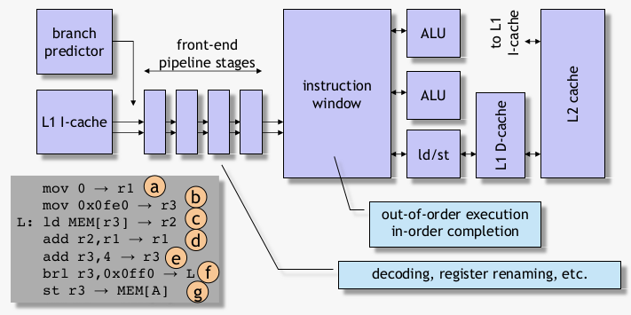

# Performance Modeling and Evaluation
Quantifying and understanding performance

### An observation...
Aplha 21264
- Can fetch up to 4 instructions per cycle
  - And execute up to 6 instructions per cycle
- Archieved IPC is (much) lower
  - SPEC CPU: IPC between 1.5 and 2.5
  - Database application: IPC approx 0.5

## Explanation
What's the reason for this 'poor' level of performance
- Limited ILP?
- Due to instruction cache misses,
- Due to mispredicted branches?
- Due to data cache misses

Insight through interval analysis / modeling
- Analytical models for superscalar out-of-order processors

### Superscalar out-of-order processor



### cycles 1-11

## Is ILP the limiting factor?


As long as we have a reorder buffer is big enough, everything should be fine

### Answer: No
- There is sufficient ILP available
- Balanced processor design
  - If instruction window is sufficiently large; if sufficient number of ALUs, etc.
  - Maximum pipeline IPC can be (almost) archieved in the absence of miss events

Total execution time (in cycles) C = N/B, assuming balanced design with B the width of the processor and N total dynamic instruction count

### Quiz

> A 4-wide out-of-order processor has a 16-entry reorder buffer and 12-entry reservation station. How would you dimension the reorder buffer and reservation station for an 8-wide out-of-order processor?

> 3/4

## Due to instruction cache misses?

### cycles 10, 13-20
its only in cycle 20 that new instructions come in

### Interval analysis


### Cost for I-cache miss 
I-cache miss latency and independent of pipeline depth


### Model versus simulation


simulation experiment (only I-cache misses), avarage I-cache miss penalty

### Analytical model...
```
C = N/B +               /* assuming no misses */
    m(IL1) x L(IL1) +   /* L1 I-cache misses */
    m(IL2) x L(il2)     /* L2 I-cache misses */
```

## Due to mispredicted branches?

### Cycle 11, 13, 15-17

### Interval analysis


### Cost due to mispredicted branch
branch resolution time + front-end refill time


### Cost is dominated by branch resolution time


### Analytical model...
```
C = N/B +              /* assuming no miss events */
    m(IL1) x L(IL1) +  /* L1 I-cache misses */
    m(IL2) x L(IL2) +  /* L2 I-cache misses */
    m(br) x            /* no. mispredicted branches */
    (c res +           /* branch resolution time */
    L fe )             /* front-end pipeline depth */
```

## Due to data cache misses? (Short-latency misses)

### Cycle 10-14

### L1 D-cache misses are hidden trhough OoO execution


## Due to data cache misses? (long-latency misses)

### Cycle 13-16, 264

### Interval analysis


### Cost due to L2 D-cache miss
L2 cache miss latency


can be approximated to the memory acces time


### Multiple independent L2 D-cache misses


exploits memory-level parallelism when there are multiple L2 D-cache misses

### Cost for overlapping L2 D-cache misses


### Average latency per L2 D-cache miss


### Analytical model
```
C = N/B +                    /* assuming no misses */
    m(br) x (c(res) + L(fe)  /* branch mispredictions */
    m(IL1) x L(IL1)          /* L1 I-cache misses */
    m(IL2) x L(IL2)          /* L2 I-cache misses */
    m(DL2) x L(DL2) / MLP    /* non-overlapping L2 D-cache misses */

MLP = number of outstanding L2 load misses if at least one is outstanding

CPI stack: divide all terms in the above formula by N (no. dynamically executed insns) and represent as a stacked bar
```

### CPI stack
Where have all the cycles gone?


## Insights
Superscala out-of-order processor performance is
- Not limited by ILP
  - Assuming a balanced processor design
  - OoO execution enables hiding L1/L2 misses
- Limited by mispredicted branches
  - Cost equals branch resolution time + front-end refill time
  - Branch resolution time is important component in total cost
- Limited by I-cache misses
  - Cost equals access time to next level in hierarchy
  - Cost is independent of pipeline depth
- Limited by non-overlapping L2/LLC D-cache misses
  - Cost is access time to DRAM (next level in memory hierarchy)
  - MLP has a big impact on performance

### Quiz
> Consider a workload that spends two-thirds of its execution time in off-chip accesses. What is the speedup potential from doubling the available MLP?
>
> Note= speedup = exec time withoud optimization / exec time with optimization

> exec time withoud optimization = 1 
> the MLP could have an impact on 2/3 of the program
> 1 / (1/3 + 1/3) = 3/2
> speedup 1.5

## skip slide 63-end
